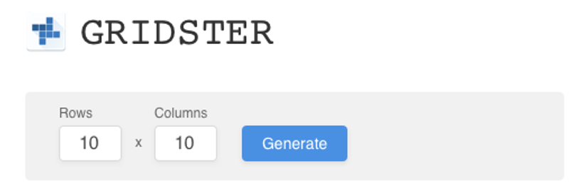

# Orinta Stracinskiene

## Contacts

**Email:** orinta.strac@gmail.com

**Github alias:** [Orintaa](https://github.com/Orintaa)

## About me

I am a highly motivated junior frontend programmer with big ambitions. My goal is to become a great developer and to create beautiful and useful products.

I have an architecture background, which helps me in creating eye-catching visuals. I am a fast learner, and I always try out different solutions before asking for help.

I am a friendly and open minded person. On my free time I like reading, jogging and playing video games.

## Skillset

I have good HTML and CSS skills. I can style projects with Sass and Bootstrap.

My main programming language is Javascript. I am learning NodeJS and React at the moment.

I also have proficiency with Adobe Photoshop and Illustrator programs and can retouch pictures and create logos.

## Code examples



```javascript
import "./App.css";
import logo from "./logo.png";
import {GridGenerator} from "./components/gridGenerator/GridGenerator";

function App() {

  return (
    <div className="App">
      <header className="App-header">
        </img>
        <GridGenerator/>
      </header>
    </div>
  );
}

export default App;
```

```javascript
import React, {useState} from "react";
import {Button} from "../button/Button";
import {Input} from "../input/Input";

const DEFAULT_CELL_COUNT = 10;

export const GridGenerator = () => {
   
    const [rows, setRows] = useState(DEFAULT_CELL_COUNT);
    const [columns, setColumns] = useState(DEFAULT_CELL_COUNT);
    const onFormSubmit = (e) => {
        e.preventDefault();
        console.log(rows);
    };

    return (
        <form onSubmit={onFormSubmit}>
            <Input label={"Rows"} value={rows} onChange={setRows} name="rows"/>

            <Input label={"Columns"} value={columns} onChange={setColumns} name="columns"/>

            <Button type="submit">PressMePlease</Button>
        </form>
    );
}
```

```javascript
import "./input.css";

export const Input = ({ label, value, name, onChange }) => {
  return (
    <div className="form-container">
      <label className="label" htmlFor={name}>
        {label}
      </label>
      <input
        className="input"
        type="text"
        name={name}
        value={value}
        onChange={(e) => {
          onChange(e.target.value);
        }}
      />
    </div>
  );
};

```

## Education

* BIT frontend developer course (9 months, still ongoing).
* We Can Code workshop.
* Women go tech mentee.
* Udemy, Codecademy courses.

## English

B2 skill level in writing and speaking.
